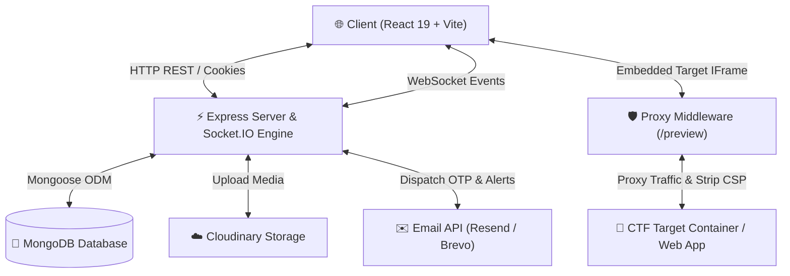

# ⚡ SPECTRE CTF — Next-Gen Cybersecurity Battleground & Learning Arena

[](https://opensource.org/licenses/MIT)
[](https://react.dev/)
[](https://vitejs.dev/)
[](https://nodejs.org/)
[](https://expressjs.com/)
[](https://www.mongodb.com/)
[](https://socket.io/)
[](https://tailwindcss.com/)

**SPECTRE CTF** is a production-grade, high-performance cybersecurity Capture The Flag (CTF) and training platform designed for competitive tournaments, university cybersecurity clubs, and security research groups.

Combining the tactical depth of **Hack The Box**, the guided paths of **TryHackMe**, and the high-energy feel of **esports leaderboards**, SPECTRE delivers a sleek, futuristic dark-mode UI with low-latency real-time updates and seamless in-browser challenge engagement.

---

## 🌟 Key Features

### ⚔️ Live CTF Battleground & Real-Time Engine
* **Socket.IO Real-Time Feeds**: Instant notifications for challenge solves, first blood achievements, system announcements, and dynamic score updates.
* **Live Player Counter**: Device-fingerprinted socket connection tracking displaying live online competitors.
* **Tactical Activity Terminal**: Streamed event log displaying solve feeds, user level-ups, and deployment events.

### 🧩 Dynamic Challenge Arena
* **Multi-Category Challenges**: Web Exploitation, Binary Exploitation (Pwn), Reverse Engineering, Cryptography, Digital Forensics, OSINT, and Miscellaneous.
* **Dynamic Point Decay & Scoring**: Points dynamically decay as solve count increases to reflect real challenge difficulty.
* **Hint System & Unlocks**: Scaled hint penalization with user confirmation and history tracking.
* **Flag Submission Engine**: Real-time flag verification with duplicate submission blocking, hint state checks, and anti-cheat validation.
* **Target Container Proxy**: Integrated HTTP reverse proxy middleware (`/preview/:base64url/...`) allowing sandboxed, in-browser interaction with live web targets while stripping restrictive `X-Frame-Options` and `CSP` headers.

### 📚 Interactive Learning Modules (TryHackMe Style)
* **Structured Security Courses**: Hands-on learning modules broken down into digestible sections with markdown text, embedded code blocks, and knowledge checks.
* **Drag & Drop Section Reordering**: Powered by `@dnd-kit` for seamless course creation and layout restructuring by admins.
* **Individual Progress Tracking**: Automated tracking of completed sections, XP rewards, and overall course completion status.

### 🏆 Esports Scoreboards & Player Analytics
* **Interactive Scoreboard**: Live ranking table with category filtering and position indicators.
* **Dynamic Score Progression**: Integrated `Recharts` visualizations showcasing team/player score trajectories over time.
* **Player Profile & XP System**: Customizable player profiles, XP level history, solved challenge breakdown, and achievements showcase.

### 🏟️ Tournaments & Isolated Event Arenas
* **Custom CTF Events**: Dedicated event pages with start/end countdown timers, rule definitions, and custom banners.
* **Event Access Guards & Registrations**: Role and team-based registration workflows securing private event arenas.
* **Event-Scoped Scoreboards & Arenas**: Standalone challenges, modules, and leaderboards isolated to specific tournament timeframes.

### 📝 Hacker Community & Writeups Platform
* **Technical Blogging Engine**: Create and publish challenge writeups with rich GFM Markdown support (`react-markdown`, `remark-gfm`, `rehype-raw`).
* **Code Syntax Highlighting**: Integrated Prism syntax highlighting for multiple programming languages.
* **Community Engagement**: Upvote writeups, post comments, and earn writeup reputation.
* **Moderation Pipeline**: Admin and Supervisor approval workflows to enforce flag spoiler policies during active CTF events.

### 🛡️ Enterprise-Grade RBAC & Administration
* **Role Hierarchy**: `Admin`, `Supervisor`, and `User` privilege levels.
* **Admin Dashboard**: Comprehensive system management for Users, Challenges, Events, Learning Modules, and System Announcements.
* **Activity & Audit Logs**: Detailed tracking of user logins, submissions, password changes, and administrative actions.
* **Cloud Infrastructure**: Cloudinary integration for media assets and writeup images; Brevo & Resend integration for transactional emails and OTP verifications.

---

## 🏗️ Tech Stack & Architecture

### Frontend
* **Core**: React 19, Vite 8, React Router v7
* **Styling & UI**: Cyberpunk Dark Theme, Custom CSS Variables, Glassmorphism, Lucide Icons
* **Data Visualization**: Recharts
* **Drag & Drop**: `@dnd-kit/core`, `@dnd-kit/sortable`
* **Real-time Sync**: `socket.io-client`
* **Markdown & Code**: `react-markdown`, `react-syntax-highlighter`, `prismjs`

### Backend
* **Runtime**: Node.js (ES Modules)
* **Framework**: Express.js 4
* **Database**: MongoDB with Mongoose ODM
* **Real-time Gateway**: Socket.IO 4
* **Proxy Middleware**: `http-proxy-middleware` (for sandboxed challenge framing)
* **Scheduled Tasks**: `node-cron`
* **Authentication**: JSON Web Tokens (JWT) stored in HTTP-Only Cookies / Authorization Headers, `bcryptjs`
* **File & Media Storage**: Cloudinary, Multer
* **Email Services**: Brevo API (`@getbrevo/brevo`), Resend API

---

## 📐 System Architecture Diagram



---

## 📁 Directory Structure

```
Spectre CTF/
├── client/                      # Frontend Application (React + Vite)
│   ├── public/                  # Static assets & favicon
│   ├── src/
│   │   ├── assets/              # Branding images, icons, logos
│   │   ├── components/          # Reusable UI components
│   │   │   ├── common/          # ProtectedRoute, RoleRoute, Navbar, Footer
│   │   │   ├── dashboard/       # Leaderboards, Activity feeds, Terminal components
│   │   │   └── modals/          # Challenge submission, Hint modal, Confirmations
│   │   ├── constants/           # Platform settings & category mappings
│   │   ├── context/             # AuthContext, EventContext
│   │   ├── hooks/               # Custom React hooks (useSocket, useAuth, etc.)
│   │   ├── layouts/             # MainLayout, DashboardLayout, EventLayout
│   │   ├── pages/
│   │   │   ├── Admin/           # Admin & Supervisor management dashboards
│   │   │   ├── Auth/            # Login, Signup, OTP Verification, Password Reset
│   │   │   ├── Challenges/      # Challenge grid, modal detail, submission arena
│   │   │   ├── Dashboard/       # Main dashboard, Scoreboard, Notifications
│   │   │   ├── Events/          # Event Hub, Event Overview, Arena & Teams
│   │   │   ├── Modules/         # Learning modules list, Module Reader, Editor
│   │   │   ├── Profile/         # User profile, statistics, solved challenges
│   │   │   └── Writeups/        # Writeup feed, Create writeup, Detail view
│   │   ├── services/            # Axios API client modules
│   │   ├── sockets/             # Socket.IO connection manager
│   │   └── styles/              # Global styles, Cyberpunk design system
│   ├── package.json
│   └── vite.config.js
│
└── server/                      # Backend Application (Node.js + Express)
    ├── controllers/             # Request handling logic
    ├── middleware/              # Auth guard, Role verification, Error handlers
    ├── models/                  # Mongoose Schemas (User, Challenge, Event, Writeup, etc.)
    ├── routes/                  # API Endpoint definitions
    │   ├── activity.js          # Live logs and activity timeline
    │   ├── admin.js             # Admin management & system metrics
    │   ├── adminChallenges.js   # Challenge CRUD endpoints
    │   ├── auth.js              # Auth, Login, Register, Password Reset
    │   ├── challenges.js        # Challenge solving, hints, flag submission
    │   ├── events.js            # CTF Event & Tournament endpoints
    │   ├── modules.js           # Learning modules & section progress
    │   ├── notifications.js     # User & system announcements
    │   ├── upload.js            # File & image upload to Cloudinary
    │   ├── users.js             # Profiles, XP history, leaderboards
    │   └── writeups.js          # Community writeups & voting
    ├── scripts/                 # Utility scripts (e.g. hash cracking, DB seeds)
    ├── utils/                   # Email dispatchers, Scheduler, Helpers
    ├── index.js                 # Entry point, Express app & Socket.IO server
    └── package.json
```

---

## 🔌 Key API Endpoints Reference

| Route Prefix | Description | Auth Required |
| :--- | :--- | :---: |
| `POST /api/auth/register` | Register a new competitor account | ❌ |
| `POST /api/auth/login` | Authenticate and retrieve JWT session | ❌ |
| `GET /api/auth/me` | Fetch authenticated user details | ✅ |
| `GET /api/challenges` | Get list of available challenges with solve status | ✅ |
| `POST /api/challenges/:id/submit` | Submit a flag for verification | ✅ |
| `POST /api/challenges/:id/hint` | Unlock a challenge hint | ✅ |
| `GET /api/events` | List upcoming and active CTF events | ✅ |
| `GET /api/events/:id/arena` | Access event arena, scoreboards, and challenges | ✅ |
| `GET /api/modules` | Fetch interactive learning modules | ✅ |
| `GET /api/writeups` | Browse community writeups | ✅ |
| `POST /api/writeups` | Submit a new technical writeup | ✅ |
| `GET /api/users/scoreboard` | Global leaderboard ranking data | ✅ |
| `GET /api/admin/users` | Admin user management list | 🛡️ Admin |
| `POST /api/upload` | Upload avatar / attachment to Cloudinary | ✅ |

---

## ⚡ Socket.IO Real-Time Events

| Event Name | Direction | Payload Description |
| :--- | :--- | :--- |
| `players:count` | Server ➔ Client | Total count of active connected devices |
| `activity:join` | Client ➔ Server | User joins personal real-time notification channel |
| `activity:leave` | Client ➔ Server | User leaves notification channel |
| `solve:new` | Server ➔ Client | Broadcast when any player solves a challenge |
| `first_blood` | Server ➔ Client | Special broadcast for the first user to solve a challenge |
| `notification:new` | Server ➔ Client | System announcement or team invite alert |

---

## 🚀 Getting Started & Local Setup

### Prerequisites
* **Node.js**: v18.0.0 or higher
* **npm**: v9.0.0 or higher
* **MongoDB**: Local MongoDB instance or MongoDB Atlas connection URI

---

### 1️⃣ Clone the Repository
```bash
git clone https://github.com/spectreIIT/Spectre-Website.git
cd Spectre-Website
```

---

### 2️⃣ Environment Configuration

#### Server Environment (`server/.env`)
Create a `.env` file in the `server` directory:
```env
PORT=5000
MONGO_URI=mongodb://127.0.0.1:27017/spectre-ctf
JWT_SECRET=your_super_secret_jwt_key_here
CLIENT_URL=http://localhost:5173

# Optional: Cloudinary Configuration (for file uploads)
CLOUDINARY_CLOUD_NAME=your_cloud_name
CLOUDINARY_API_KEY=your_api_key
CLOUDINARY_API_SECRET=your_api_secret

# Optional: Email Services (Resend or Brevo)
RESEND_API_KEY=re_your_resend_api_key
BREVO_API_KEY=xkeysib-your_brevo_api_key
EMAIL_FROM=noreply@spectrectf.com
```

#### Client Environment (`client/.env`)
Create a `.env` file in the `client` directory:
```env
VITE_API_URL=http://localhost:5000/api
VITE_SOCKET_URL=http://localhost:5000
```

---

### 3️⃣ Install Dependencies

#### Install Backend Dependencies:
```bash
cd server
npm install
```

#### Install Frontend Dependencies:
```bash
cd ../client
npm install
```

---

### 4️⃣ Run in Development Mode

#### Start Backend Server:
```bash
cd server
npm run dev
```
*The server will start on `http://localhost:5000` with hot-reloading and Socket.IO active.*

#### Start Frontend Client:
```bash
cd client
npm run dev
```
*The client application will start on `http://localhost:5173`.*

---

## 🛠️ Build for Production

To build the client application for production deployment:

```bash
cd client
npm run build
```
The optimized static build files will be generated in `client/dist`.

---

## 🛡️ Security Features

* **HTTP-Only Cookies & JWT Auth**: Secure authentication preventing token theft via XSS.
* **Dynamic Target Proxying**: Dedicated preview reverse proxy strips unsafe CORS / CSP / X-Frame-Options headers while maintaining isolation between CTF infrastructure and platform core.
* **Flag Hashing & Verification**: Robust server-side flag comparison enforcing exact string match and anti-replay protection.
* **Role Guards**: Express middleware and React Router role access guards enforcing access control across Admin, Supervisor, and Competitor views.

---

## 🤝 Contributing

Contributions are welcome! If you want to add new challenges, learning modules, or UI improvements:

1. Fork the Repository.
2. Create your Feature Branch (`git checkout -b feature/AmazingFeature`).
3. Commit your Changes (`git commit -m 'Add some AmazingFeature'`).
4. Push to the Branch (`git push origin feature/AmazingFeature`).
5. Open a Pull Request.

---

## 📜 License

This project is licensed under the **MIT License** — see the [LICENSE](LICENSE) file for details.

---

<p center="text-center">
  <b>Designed & Developed for SPECTRE CTF Community 🚀</b>
</p>
